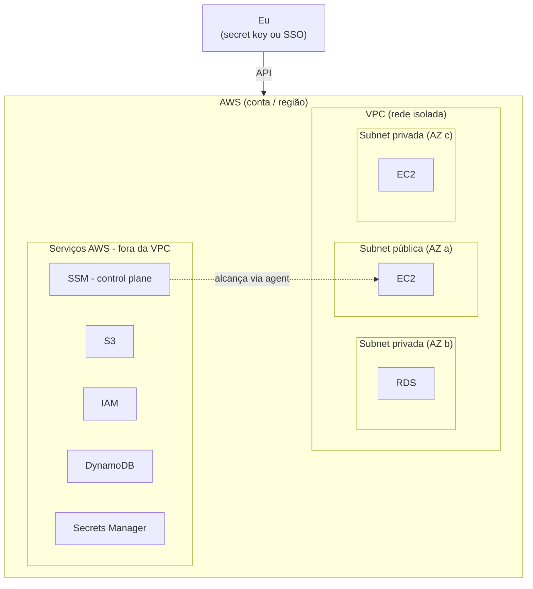

# 1. AWS Box

Basicamente AWS são serviços em nuvem, porem podemos pensar como uma CAIXA grande, aonde dentro dela temos várias divisões. Na qual são

- API dos serviços
- VPC

# 2. Diagrama

```mermaid
flowchart TB
    Eu["Eu<br/>(secret key ou SSO)"] -->|API| AWS

    subgraph AWS["AWS (conta / região)"]
        subgraph Fora["Serviços AWS - fora da VPC"]
            S3[S3]
            IAM[IAM]
            SSM[SSM - control plane]
            DDB[DynamoDB]
            SM[Secrets Manager]
        end

        subgraph VPC["VPC (rede isolada)"]
            subgraph SubA["Subnet pública (AZ a)"]
                EC2A[EC2]
            end
            subgraph SubB["Subnet privada (AZ b)"]
                RDS[RDS]
            end
            subgraph SubC["Subnet privada (AZ c)"]
                EC2C[EC2]
            end
        end

        SSM -.->|alcança via agent| EC2A
    end
```